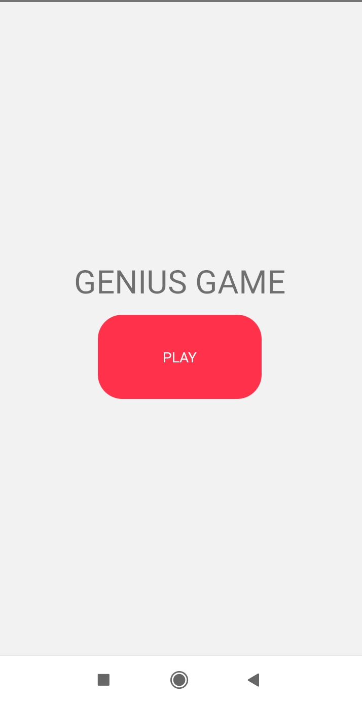
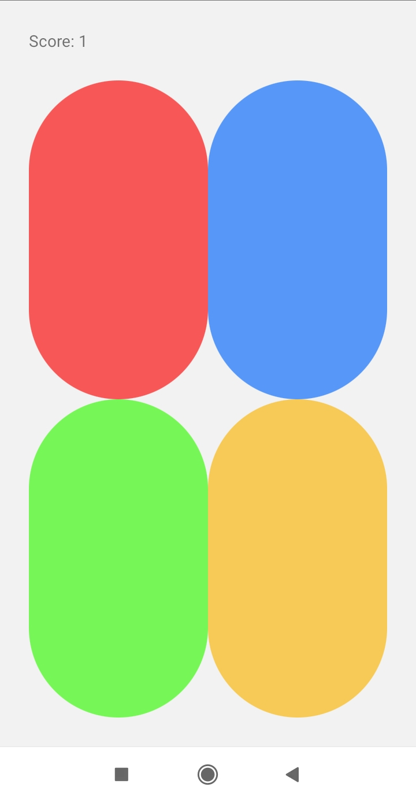
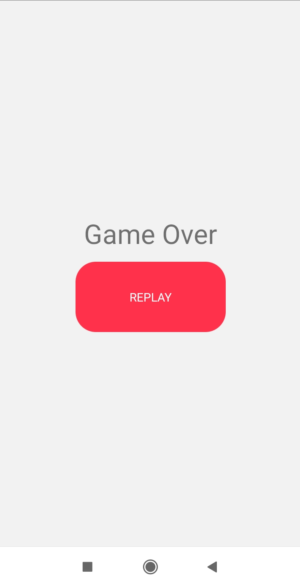

# Genius Game React Native

uma versão mobile do famoso jogo da memória.
#
## Como Usar
``` 
git clone git@github.com:luizphelipe800/GeniusGameRN.git 
```
```
cd GeniusGameRN && yarn install
```
```
yarn android ou npm run android
```
```
yarn start ou npm run start
```
#
## Demonstração



#



#



#

## Tecnologias Usadas
* React Native
* React Native Navigation
* React Native Splash Screen
* React Native Sound